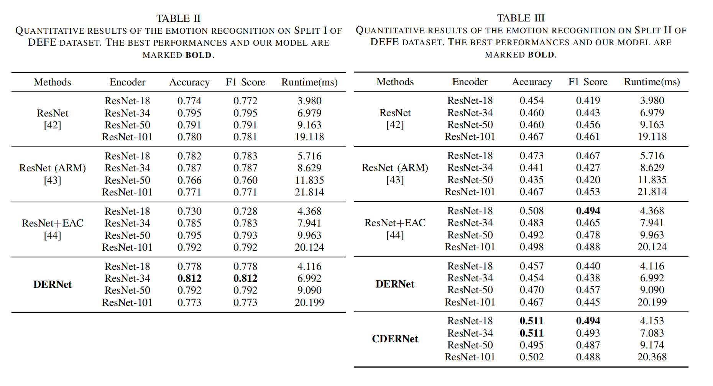
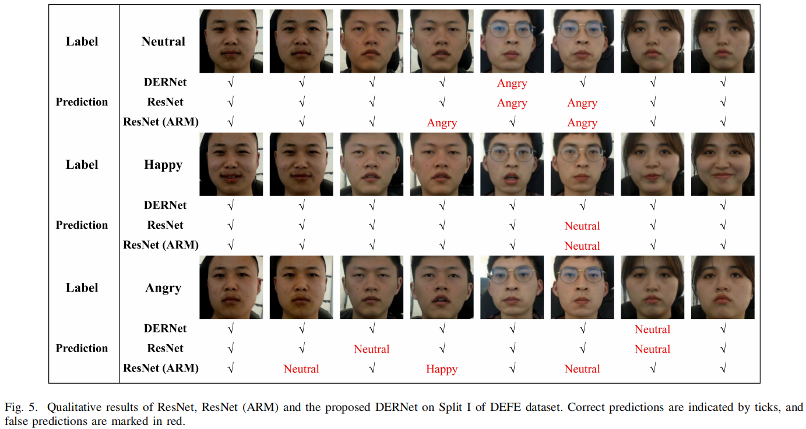
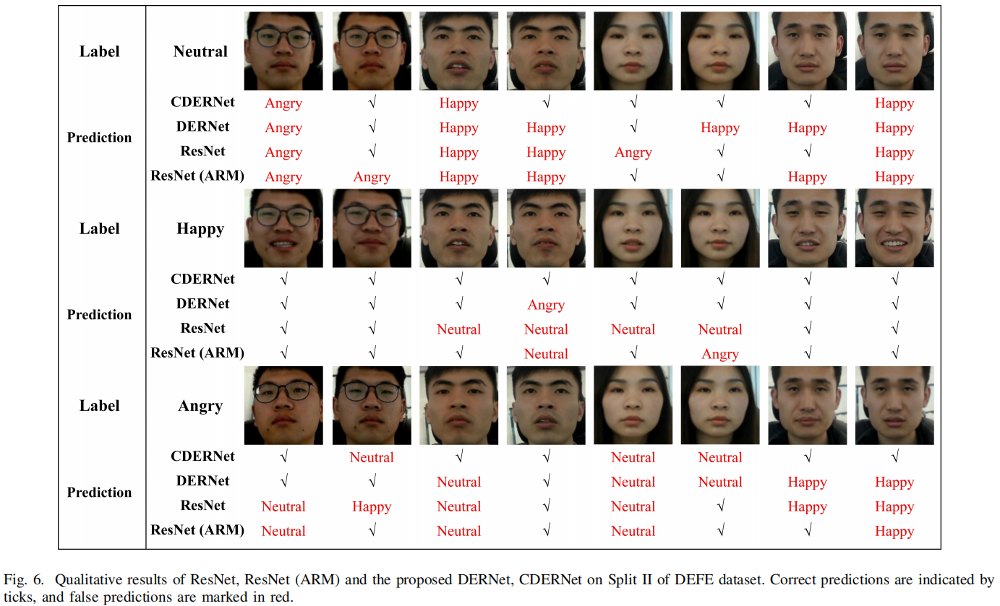

# CDERNet

This is the Pytorch implementation of CDERNet proposed in paper 'DERNet: Driver Emotion Recognition Using On-board Camera' by Dingyu Wang, Shaocheng Jia, Xin Pei, Chunyang Han and Danya Yao.

# Overview


# Results





# Requirements

python 3.8.12  
pytorch 1.10.0  
numpy 1.19.2  
torchvision 0.8.1  
matplotlib 3.3.2  
opencv-python 4.4.0  
dlib 19.8.1  
face-recognition 1.3.0  
scikit-image 0.17.2  
scikit-learn 0.23.2

# Quick Start

## Data Preparation

Download DEFE dataset, and make sure it have a structure like following (the first character of file name represents its label):

```
-datasets/DEFE/raw_data/
  train/
    0-xxx.jpg
    1-xxx.jpg
    2-xxx.jpg
    ...
  test/
    0-xxx.jpg
    1-xxx.jpg
    2-xxx.jpg
    ...
```

## Data Preprocessing

```
python facedetection.py
```

## Training

```
train.py --embedding_size 256 --alpha 0.7
```
